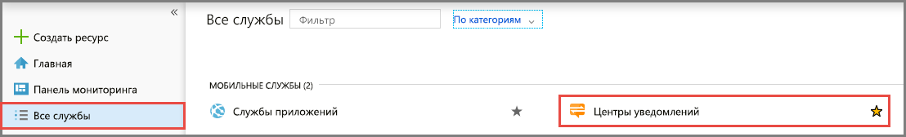
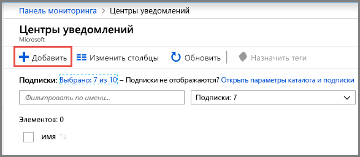
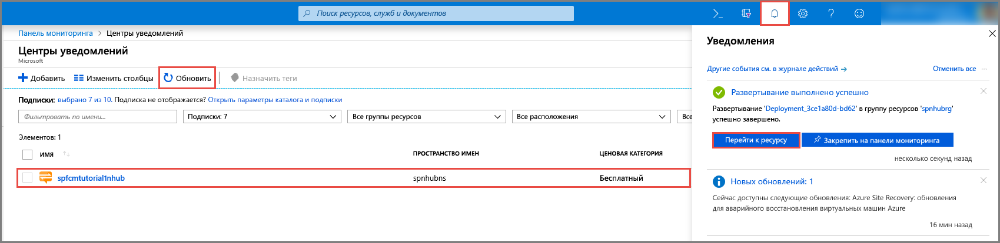

1. Войдите на [портале Azure](https://portal.azure.com).

1. Выберите **Все службы** в меню слева и щелкните **Центры уведомлений** в разделе **Мобильный**. Щелкните значок звездочки рядом с именем службы, чтобы добавить ее в раздел **Избранное** в меню слева. После добавления **Центров уведомлений** в **Избранное** выберите их в меню слева.

      

1. На странице **Центры уведомлений** выберите **Добавить** на панели инструментов.

      

1. На странице **Концентратор уведомлений** выполните следующие действия:

    1. Введите имя в поле **Центр уведомлений**.  

    1. Введите имя в поле **Создать пространство имен**. Пространство имен содержит один или несколько центров.

    1. Выберите значение в раскрывающемся списке **Расположение**. Это значение определяет расположение, в котором создается центр.

    1. В поле **Группа ресурсов** выберите существующую группу ресурсов или укажите имя для новой группы ресурсов.

    1. Нажмите кнопку **Создать**.

        

1. Последовательно выберите **Уведомления** (значок колокольчика) и **Перейти к ресурсу**. Вы также можете обновить список на странице **Центры уведомлений** и выбрать свой центр.

      

1. Выберите **Политики доступа** в списке. Обратите внимание, что станут доступны две строки подключения. Они потребуются позже для обработки push-уведомлений.

      >[!IMPORTANT]
      >*Не* используйте в приложении политику **DefaultFullSharedAccessSignature**. Этот параметр можно использовать только в серверной части.
      >

      
