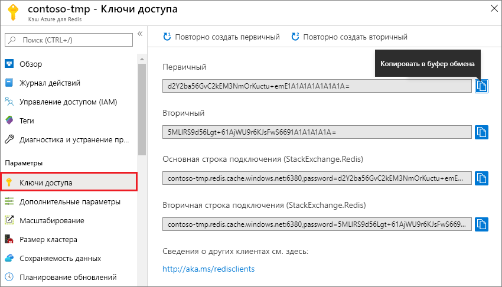
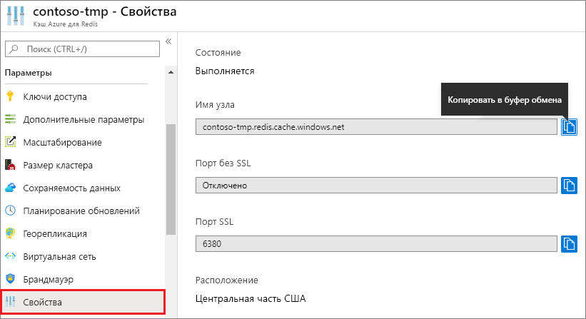

### Получение имени узла, сведений о портах и ключей доступа с помощью портала Azure

Чтобы подключаться к экземпляру предложения "Кэш для Redis", клиентам кэша нужны имя узла, сведения о портах и ключ кэша. Некоторые клиенты могут ссылаться на эти элементы с помощью незначительно различающихся имен. Эти данные можно получить на портале Azure.

#### Получение ключей доступа и имени узла

1. Чтобы получить ключи доступа с помощью [портала Azure](https://portal.azure.com), перейдите к своему кэшу и выберите **Ключи доступа**. 

    

2. Чтобы получить имя узла и сведения о портах, выберите **Свойства**.

    

