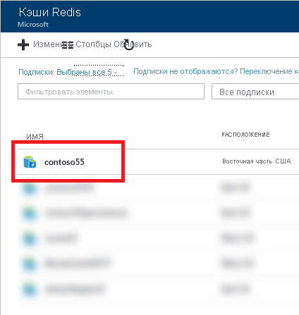
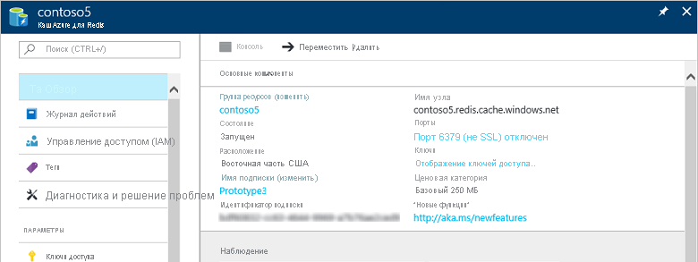

Если вы не закрепили кеш на панели мониторинга, найдите его на [портале Azure ](https://portal.azure.com) через меню **Все службы**.

Чтобы просмотреть кэши, щелкните **Все службы** и выполните поиск по фразе **Azure Cache for Redis** (Кэш Redis для Azure). 

Выберите кэш, для которого необходимо просмотреть и настроить параметры.

Просмотреть и настроить кэш можно в колонке **Azure Cache for Redis** (Кэш Redis для Azure).

