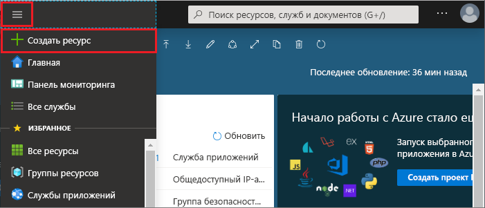

1. Чтобы создать кэш, войдите на [портал Azure](https://portal.azure.com) и выберите **Создать ресурс**. 
   
   
   
1. На странице **Создание** выберите **Базы данных**, а затем **Кэш Azure для Redis**.
   
   
   
1. На странице **Новый кэш Redis** настройте параметры для нового кэша.
   
   | Параметр      | Рекомендуемое значение  | ОПИСАНИЕ |
   | ------------ |  ------- | -------------------------------------------------- |
   | **DNS-имя** | Введите глобально уникальное имя | Имя кэша должно быть строкой длиной от 1 до 63 символов и содержать только цифры, буквы и дефисы. Имя должно начинаться и заканчиваться цифрой или буквой и не может содержать более одного дефиса подряд. *Имя узла* для экземпляра кэша получит значение *\<DNS-имя>.redis.cache.windows.net*. | 
   | **подписка** | Раскройте список и выберите нужную подписку. | В этой подписке будет создан новый экземпляр кэша Redis для Azure. | 
   | **группа ресурсов** | Раскройте список и выберите группу ресурсов или нажмите **Создать** и введите имя для новой группы ресурсов. | Имя группы ресурсов, в которой будут созданы кэш и другие ресурсы. Поместив все ресурсы приложения в одну группу ресурсов, вы сможете легко управлять ими и/или удалить их вместе. | 
   | **Местоположение.** | Откройте список и выберите расположение. | Выберите оптимальный [регион](https://azure.microsoft.com/regions/) для других служб, которые будут использовать кэш. |
   | **Ценовая категория** | Откройте список и выберите [ценовую категорию](https://azure.microsoft.com/pricing/details/cache/). |  Ценовая категория определяет размер, производительность и функции, доступные для кэша. Дополнительные сведения см. в [обзоре предложения "Кэш Redis для Azure"](../articles/azure-cache-for-redis/cache-overview.md). |
   
1. Нажмите кнопку **Создать**. 
   
    
   
   На создание кэша требуется некоторое время. Вы можете отслеживать ход выполнения на странице **обзорных сведений** кэша Azure для Redis. Когда **Состояние** примет значение **Running** (Выполняется), кэш будет готов к использованию.
   
   

