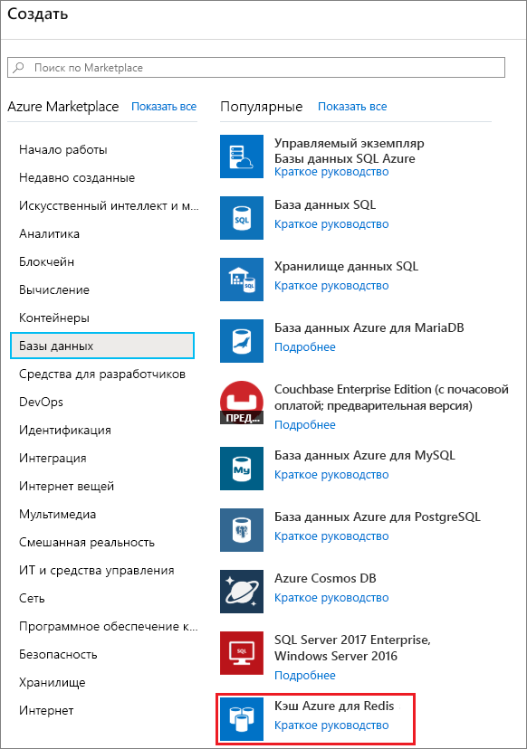
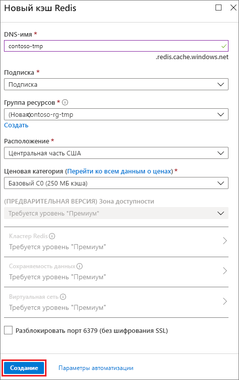
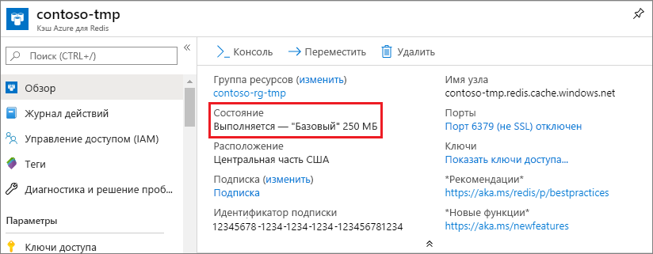

1. Чтобы создать кэш, войдите на [портал Azure](https://portal.azure.com). Затем последовательно выберите **Создать ресурс** > **Базы данных** > **Azure Cache for Redis** (Кэш Redis для Azure).

    

2. В разделе **New Azure Cache for Redis** (Новый кэш Redis для Azure) настройте параметры для нового кэша.

    | Параметр      | Рекомендуемое значение  | ОПИСАНИЕ |
    | ------------ |  ------- | -------------------------------------------------- |
    | **DNS-имя** | Глобально уникальное имя | Имя кэша. Это должна быть строка длиной от 1 до 63 символов, содержащая только цифры, буквы и символ `-`. Имя кэша не может начинаться или заканчиваться символом `-`. Также не допускается последовательное использование символов `-`.  | 
    | **подписка** | Ваша подписка | Подписка, в которой создан экземпляр кэша Redis для Azure. | 
    | **группа ресурсов** |  *TestResources* | Имя новой группы ресурсов, в которой создается кэш. Поместив все ресурсы для приложения в группу, вы можете управлять ими совместно. Например, при удалении группы ресурсов все ресурсы, связанные с приложением, также удаляются. | 
    | **Местоположение.** | Восточная часть США | Выберите [регион](https://azure.microsoft.com/regions/) поблизости от других служб, для которых будет использоваться кэш. |
    | **[Ценовая категория](https://azure.microsoft.com/pricing/details/cache/)** |  "Базовый" C0 (кэш 250 МБ) |  Ценовая категория определяет размер, производительность и функции, доступные для кэша. Дополнительные сведения см. в [обзоре предложения "Кэш Redis для Azure"](../articles/azure-cache-for-redis/cache-overview.md). |
    | **Закрепить на панели мониторинга** |  Выбрано | Закрепите новый кэш на панели мониторинга, чтобы его было проще найти. |

     

3. Когда параметры нового кэша будут настроены, выберите **Создать**. 

    Создание кэша может занять несколько минут. Для проверки состояния можно отслеживать ход выполнения на панели мониторинга. После создания кэш имеет состояние **Работает** и готов к использованию.

    

