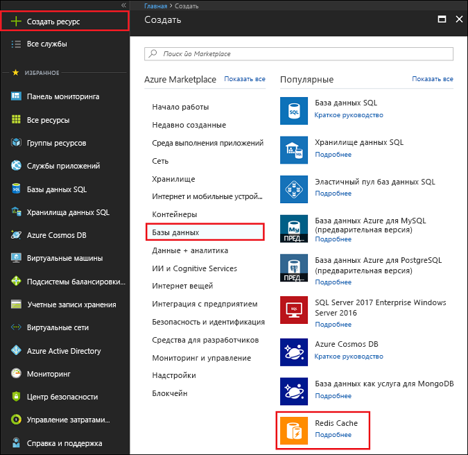
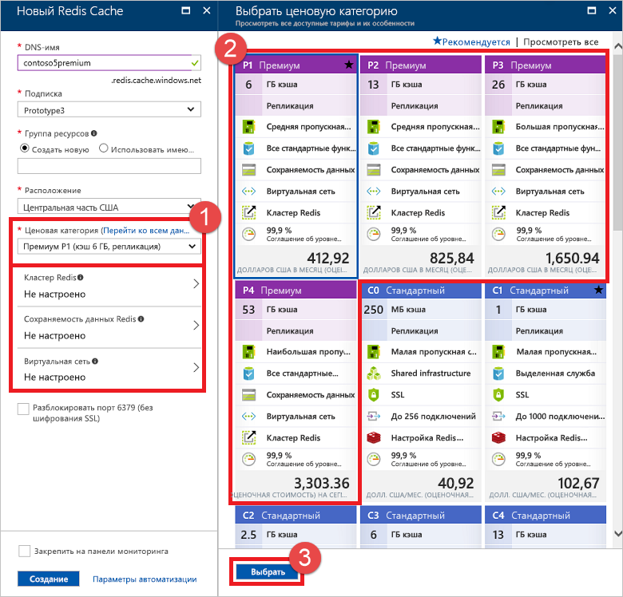

Чтобы создать кэш уровня "Премиум", войдите на [портал Azure](https://portal.azure.com) и щелкните **Создать ресурс** > **Базы данных** > **Кэш Redis**.

> [!NOTE]
> Кэши можно создавать не только на портале Azure, но и с помощью шаблонов Resource Manager, PowerShell или интерфейса командной строки Azure. Дополнительные сведения о создании кэша Redis для Azure см. в разделе [Создание кэша](../articles/redis-cache/cache-dotnet-how-to-use-azure-redis-cache.md#create-a-cache).
> 
> 

Чтобы настроить функции категории "Премиум", сначала выберите одну из соответствующих ценовых категорий в раскрывающемся списке **Ценовая категория**. Чтобы получить дополнительные сведения о каждой ценовой категории, щелкните **Перейти ко всем данным о ценах** и выберите ценовую категорию в колонке **Выбор ценовой категории**.

