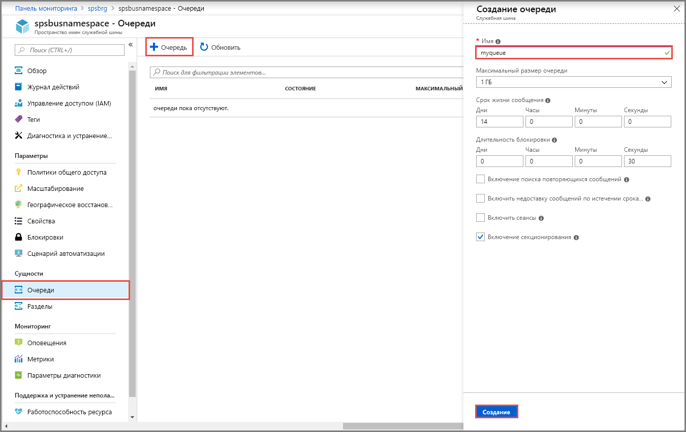

## Создание очереди на портале Azure
4. На странице **Пространство имен служебной шины** в меню навигации слева выберите **Очереди**.
5. На странице **Очереди** на панели инструментов выберите **+ Очередь**.
5. Введите **имя** очереди, остальные значения по умолчанию не изменяйте.
6. Выберите **Создать**.
 
    

