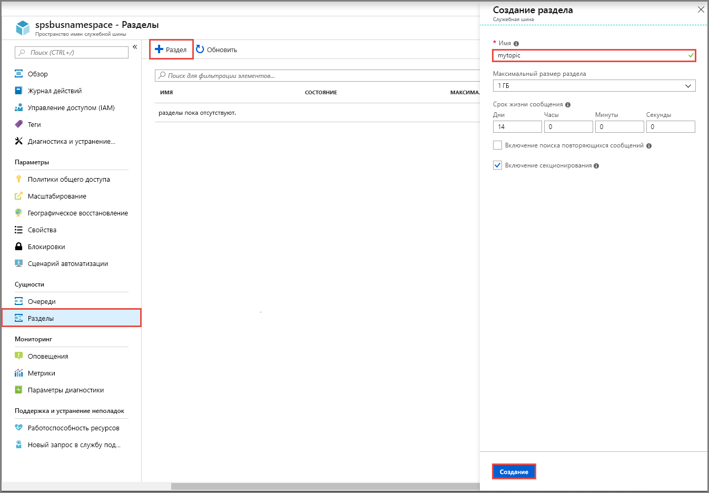
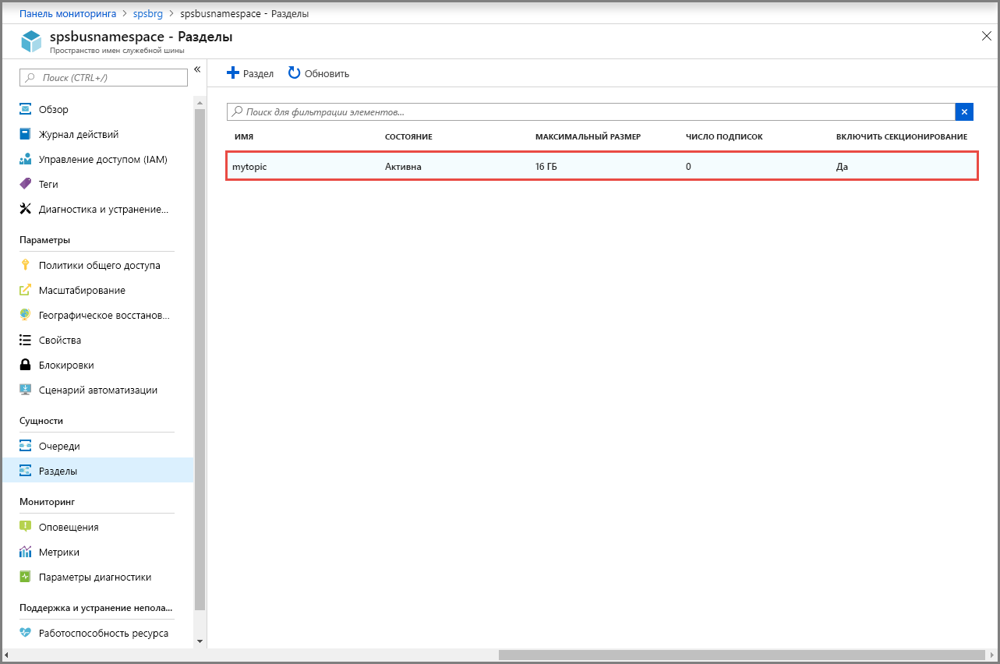
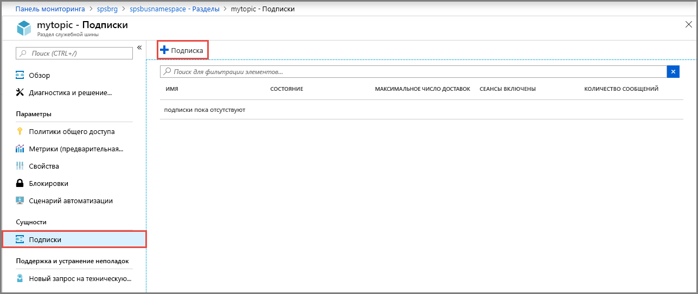

## Создание раздела с помощью портала Azure
1. На странице **Пространство имен служебной шины** выберите пункт **Разделы** в левом меню.
2. На панели инструментов выберите **+ Раздел**. 
4. Введите **имя** раздела. Для других параметров оставьте значения по умолчанию.
5. Нажмите кнопку **Создать**.

    

## Создание подписки на раздел
1. Выберите **раздел**, который был создан в предыдущем разделе. 
    
    
2. На странице **Раздел служебной шины** выберите пункт **Подписки** в левом меню, а затем — **+ Подписка** на панели инструментов. 
    
    
3. На странице **Создание подписки** введите **имя** подписки и выберите **Создать**. 

    