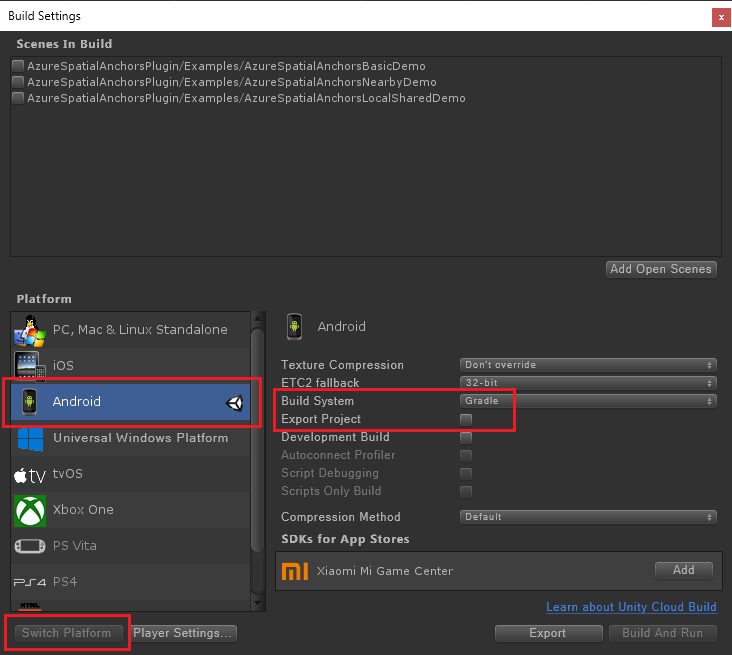

Откройте **Build Settings** (Параметры сборки), выбрав пункты **File** > **Build Settings** (Файл > Параметры сборки).

В разделе **Платформа** выберите **Android**. Измените значение параметра **Build System** (Система сборки) на **Gradle** и убедитесь, что флажок **Экспорт проекта** не установлен.

Выберите **Switch Platform** (Изменить платформу), чтобы изменить платформу на **Android**. Если отсутствуют какие-то дополнительные компоненты Android, Unity может запросить их установку.

Закройте окно **Build Settings** (Параметры сборки).

### скачать и импортировать пакеты SDK с поддержкой ARCore для Unity;

Скачайте файл `unitypackage` со страницы [выпусков пакета SDK ARCore для Unity 1.7](https://github.com/google-ar/arcore-unity-sdk/releases/tag/v1.7.0). В проекте Unity выберите **Assets** (Ресурсы) > **Import Package** (Импортировать пакет) > **Custom Package** (Пользовательский пакет), а затем выберите файл `unitypackage`, который вы только что скачали. В диалоговом окне **Import Unity Package** (Импорт пакета Unity) выберите все файлы и щелкните **Import** (Импортировать).
