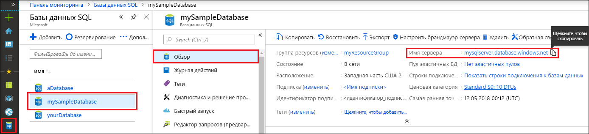

<!-- sql-database-connect-query-prerequisites-server-connection-info-includes.md 

## Get SQL server connection information
-->

Получите сведения, необходимые для подключения к базе данных SQL Azure. Для дальнейших действий вам понадобится полное имя сервера, имя базы данных и данные для входа.

1. Войдите на [портале Azure](https://portal.azure.com/).

1. В меню слева выберите **Базы данных SQL** и на странице **Базы данных SQL** выберите имя своей базы данных.

1. На странице **Обзор** вашей базы данных просмотрите полное имя сервера рядом с полем **Имя сервера**. Чтобы скопировать имя сервера, наведите на него указатель мыши и щелкните значок **копирования**.  

Если вы забыли данные для входа, щелкните имя сервера, чтобы открыть страницу **сервера SQL**. Здесь можно просмотреть имя **администратора сервера** и выбрать **сброс пароля** при необходимости.