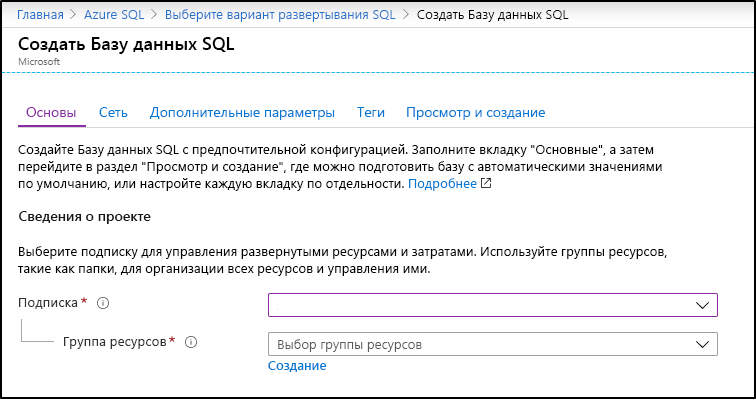
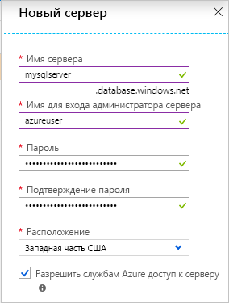
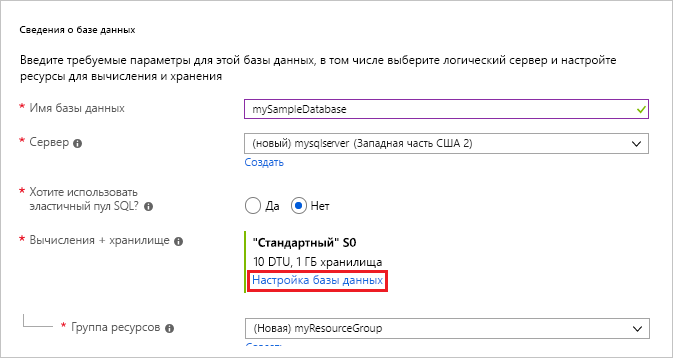
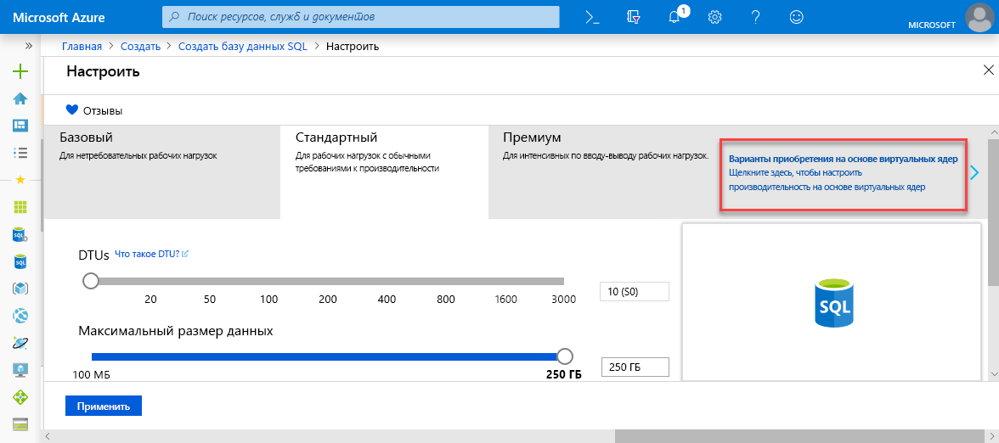
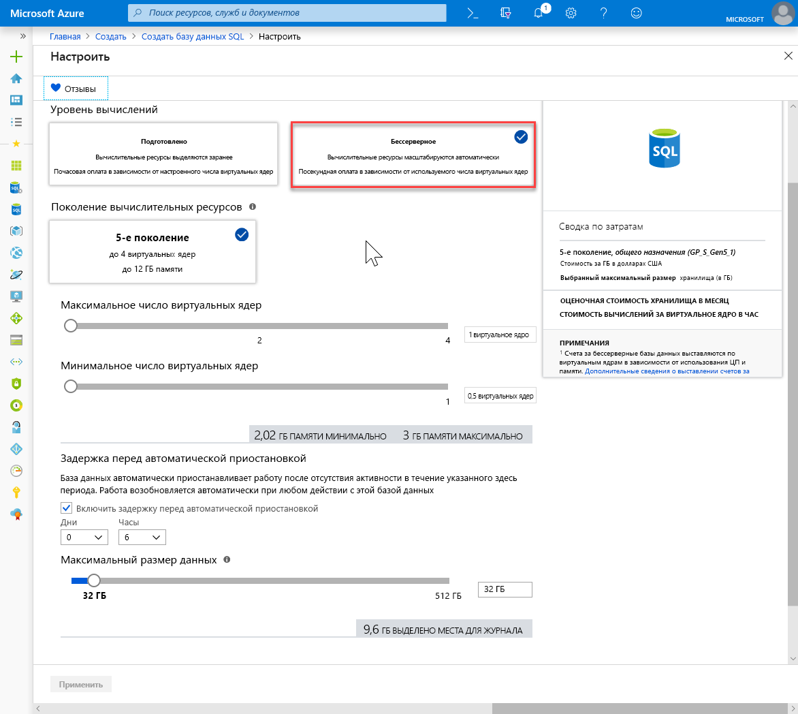
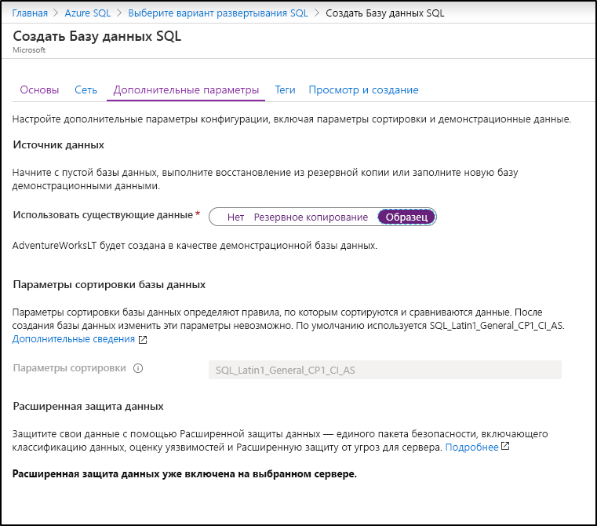

На этом шаге вы создадите группу ресурсов и отдельную базу данных SQL Azure. 

> [!IMPORTANT]
> Не забудьте настроить правила брандмауэра для использования общедоступного IP-адреса компьютера, на котором выполняются действия, описанные в этой статье. Правила брандмауэра уровня базы данных автоматически реплицируются на сервер-получатель.
>
> Дополнительные сведения см. в статье [sp_set_database_firewall_rule (Azure SQL Database)](/sql/relational-databases/system-stored-procedures/sp-set-database-firewall-rule-azure-sql-database) (sp_set_database_firewall_rule (база данных SQL Azure)). Чтобы определить IP-адрес, используемый для правила брандмауэра уровня сервера для компьютера, обратитесь к статье [Краткое руководство. Создание правила брандмауэра на уровне сервера для базы данных SQL с помощью портала Azure](../articles/sql-database/sql-database-server-level-firewall-rule.md).  

# <a name="azure-portaltabazure-portal"></a>[портал Azure](#tab/azure-portal)
Создайте группу ресурсов и одну базу данных с помощью портал Azure. 

1. Щелкните **Создать ресурс** в верхнем левом углу окна портала Azure.
2. Выберите **Базы данных**, **База данных SQL**, чтобы открыть страницу **Создать базу данных SQL**.

   

3. На вкладке **Основные сведения**  в разделе **Сведения о проекте** введите или выберите следующие значения:

   - **Подписка**: Раскройте раскрывающийся список и выберите правильную подписку, если она не отобразится автоматически.
   - **Группа ресурсов.** Выберите **Создать**, введите `myResourceGroup` и щелкните **ОК**.

     

4. В разделе **Сведения о базе данных** введите или выберите следующие значения:

   - **Имя базы данных**. Укажите `mySampleDatabase`.
   - **Сервер** — Выберите **Создать**, введите следующие значения и щелкните **Создать**.
       - **Имя сервера**. Введите `mysqlserver` и несколько цифр для уникальности имени.
       - **Учетные данные администратора сервера для входа**. Введите `azureuser`.
       - **Пароль**. Введите сложный пароль, который соответствует требованиям к паролю.
       - **Расположение.** Выберите расположение из раскрывающегося списка, например `West US 2`.

         

      > [!IMPORTANT]
      > Запомните или запишите имя входа и пароль администратора сервера, чтобы можно было войти на сервер и в базы данных для выполнения действий, описанных в этом и других кратких руководствах. Если вы забыли имя входа или пароль, получить имя входа или сбросить пароль можно на странице **сервера SQL server**. Чтобы открыть страницу **сервера SQL**, выберите имя сервера на странице **Обзор** для базы данных после создания базы данных.

        

   - **Хотите использовать пул эластичных БД SQL?** Выберите **Нет**.
   - **Вычисления и хранилище**. Выберите **Настройка базы данных** и для этого краткого руководства выберите **Варианты приобретения на основе виртуальных ядер**.

     

   - Выберите **подготовленные** и **го поколения**.

     

   - Проверьте значения параметров **Максимальное число виртуальных ядер**, **Минимальное число виртуальных ядер**, **Задержка перед автоматической приостановкой** и **Максимальный размер данных**. Измените их при необходимости.
   - Примите условия использования предварительной версии и нажмите кнопку **ОК**.
   - Нажмите кнопку **Применить**.

5. Перейдите на вкладку **Дополнительные параметры**. 
6. В разделе **Источник данных** для параметра **Использовать имеющиеся данные** выберите `Sample`. 

   

   > [!IMPORTANT]
   > Не забудьте выбрать данные **Пример (AdventureWorksLT)** , чтобы изучить это руководство и другие краткие руководства по Базе данных SQL Azure, в которых используются эти данные.

7. Оставьте остальные значения заданными по умолчанию и нажмите кнопку **Просмотр и создание** в нижней части формы.
8. Проверьте параметры и нажмите кнопку **Создать**.

9. В форме **База данных SQL** щелкните **Создать**, чтобы развернуть и подготовить группу ресурсов, сервер и базу данных.

# <a name="powershelltabpowershell"></a>[PowerShell](#tab/powershell)

[!INCLUDE [updated-for-az](updated-for-az.md)]

Создайте группу ресурсов и одну базу данных с помощью PowerShell. 

   ```powershell-interactive
   # Set variables for your server and database
   $SubscriptionId = '<Your Azure subscription ID>'
   $ResourceGroupName = "myResourceGroup" # to randomize: "myResourceGroup-$(Get-Random)"
   $Location = "westus2"
   $AdminLogin = "azureuser"
   $Password = "ChangeYourAdminPassword1"
   $ServerName = "mysqlserver" # to randomize: "mysqlserver-$(Get-Random)"
   $DatabaseName = "mySampleDatabase"
   
   
   # The ip address range that you want to allow to access your server 
   #(leaving at 0.0.0.0 will prevent outside-of-azure connections to your DB)
   $startIp = "0.0.0.0"
   $endIp = "0.0.0.0"
   
   # Connect to Azure
   Connect-AzAccount

   # Set subscription ID
   Set-AzContext -SubscriptionId $subscriptionId 
   
   # Create a resource group
   $resourceGroup = New-AzResourceGroup -Name $ResourceGroupName -Location $Location
   
   # Create a server with a system wide unique server name
   $server = New-AzSqlServer -ResourceGroupName $ResourceGroupName `
      -ServerName $ServerName `
      -Location $Location `
      -SqlAdministratorCredentials $(New-Object -TypeName System.Management.Automation.PSCredential -ArgumentList $AdminLogin, $(ConvertTo-SecureString -String $Password -AsPlainText -Force))
   
   # Create a server firewall rule that allows access from the specified IP range
   $serverFirewallRule = New-AzSqlServerFirewallRule -ResourceGroupName $ResourceGroupName `
      -ServerName $ServerName `
      -FirewallRuleName "AllowedIPs" -StartIpAddress $startIp -EndIpAddress $endIp
   
   # Create General Purpose Gen4 database with 1 vCore
   $database = New-AzSqlDatabase  -ResourceGroupName $ResourceGroupName `
      -ServerName $ServerName `
      -DatabaseName $DatabaseName `
      -Edition GeneralPurpose `
      -VCore 1 `
      -ComputeGeneration Gen4  `
      -MinimumCapacity 1 `
      -SampleName "AdventureWorksLT"
   ```

# <a name="az-clitabbash"></a>[AZ CLI](#tab/bash)
Создайте группу ресурсов и одну базу данных с помощью команды AZ CLI. 


   ```azurecli-interactive
   #!/bin/bash
   # Set variables
   export subscriptionID=<Your Subscription ID>
   export ResourceGroupName=myResourceGroup # to randomize: myResourceGroup-$RANDOM
   export Location=WestUS2
   export AdminLogin=azureuser
   export Password=ChangeYourAdminPassword1
   export ServerName="mysqlserver" # to randomize: mysqlserver-$RANDOM
   export DatabaseName=mySampleDatabase
   
   # The ip address range that you want to allow to access your DB. 
   # (leaving at 0.0.0.0 will prevent outside-of-azure connections to your DB)
   export startip=0.0.0.0
   export endip=0.0.0.0
  
   # Connect to Azure
   az login

   $ Set subscription ID
   az account set --subscription $SubscriptionID
   
   # Create a resource group
   az group create \
      --name $ResourceGroupName \
      --location $Location
   
   # Create a logical server in the resource group
   az sql server create \
      --name $ServerName \
      --resource-group $ResourceGroupName \
      --location $Location  \
      --admin-user $AdminLogin\
      --admin-password $Password
   
   # Configure a firewall rule for the server
   az sql server firewall-rule create \
      --resource-group $ResourceGroupName \
      --server $ServerName \
      -n AllowYourIp \
      --start-ip-address $startip \
      --end-ip-address $endip
   
   # Create a database in the server 
   az sql db create \
      --resource-group $ResourceGroupName \
      --server $ServerName \
      --name $DatabaseName \
      --sample-name AdventureWorksLT \
      --edition GeneralPurpose \
      --family Gen4 \
      --capacity 1 \
   ```

---