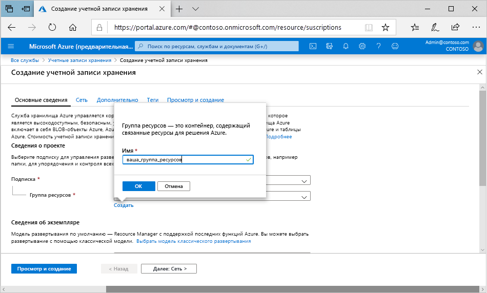

Чтобы создать учетную запись хранения общего назначения версии 2 на портале Azure, сделайте следующее:

1. В меню портала Azure выберите **Все службы**. В списке ресурсов введите **Учетные записи хранения**. Как только вы начнете вводить символы, список отфильтруется соответствующим образом. Выберите **Учетные записи хранения**.
2. В появившемся окне **Учетные записи хранения** выберите **добавить**.
3. Выберите подписку, в которой будет создана учетная запись хранения.
4. В поле **Группа ресурсов** выберите **Создать**. Введите имя для новой группы ресурсов, как показано на следующем рисунке.

    

5. Далее введите имя своей учетной записи хранения. Выбранное вами имя должно быть уникальным в Azure. Также имя должно содержать от 3 до 24 символов и может состоять только из цифр и строчных букв.
6. Выберите расположение учетной записи хранения или используйте расположение по умолчанию.
7. Оставьте в следующих полях значения по умолчанию.

   |Поле  |Значение  |
   |---------|---------|
   |Модель развертывания     |Resource Manager         |
   |Производительность     |Standard         |
   |Тип учетной записи     |StorageV2 (учетная запись общего назначения версии 2)         |
   |Репликация     |Геоизбыточное хранилище с доступом для чтения (RA-GRS)         |
   |Уровень доступа     |Горячий         |

8. Если вы планируете использовать [Azure Data Lake Storage](https://azure.microsoft.com/services/storage/data-lake-storage/), перейдите на вкладку **Дополнительно** и укажите для параметра **Иерархическое пространство имен** значение **Включено**.
9. Выберите **Просмотр и создание**, чтобы просмотреть настройки учетной записи хранения и создать учетную запись.
10. Нажмите кнопку **создания**.

Дополнительные сведения о типах учетных записей хранения см. в статье [Общие сведения об учетной записи хранения](https://docs.microsoft.com/azure/storage/common/storage-account-overview). Дополнительные сведения о группах ресурсов см. в статье [Общие сведения об Azure Resource Manager](https://docs.microsoft.com/azure/azure-resource-manager/resource-group-overview). 
