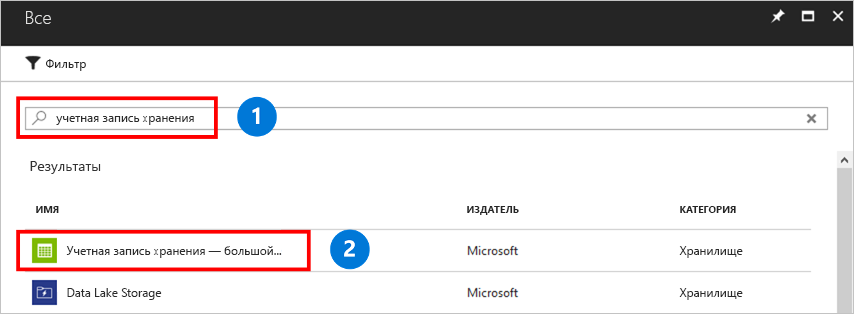

Учетная запись хранения — это общий пул для хранения, в котором можно развернуть файловые ресурсы Azure или другие ресурсы хранения, например большие двоичные объекты или очереди. Учетная запись хранения может содержать неограниченное число файловых ресурсов. В общем ресурсе может храниться любое число файлов, насколько это позволяет емкость учетной записи хранения.

Чтобы создать учетную запись хранения, сделайте следующее:

1. В меню слева выберите **+** , чтобы создать ресурс.
1. Введите в поле поиска **учетная запись хранения**, выберите в результатах поиска **Учетная запись хранения — большой двоичный объект, файл, таблица, очередь** и нажмите кнопку **Создать**.
    

1. В поле **Имя** вводите *mystorageacct* с несколькими случайными числами, пока не появится зеленый значок, означающий, что это уникальное имя. Имя учетной записи хранения следует указывать в нижнем регистре. Оно должно быть глобально уникальным. Запишите имя учетной записи хранения. Оно понадобится вам позже. 
1. В поле **Модель развертывания** оставьте значение по умолчанию — **Resource Manager**. См. дополнительные сведения о [развертывании с помощью Azure Resource Manager и классическом развертывании (сведения о моделях развертывания и состоянии ресурсов)](../articles/azure-resource-manager/management/deployment-models.md).
1. В поле **Производительность** оставьте значение по умолчанию **Стандартный**.
    
    > [!NOTE]
    > В этом кратком руководстве описано, как создать стандартную общую папку. Если же вы хотите использовать общие папки уровня "Премиум", выберите **Премиум**.

1. В поле **Тип учетной записи** выберите **StorageV2**. См. дополнительные сведения о [разных типах учетных записей хранения Azure](../articles/storage/common/storage-account-overview.md?toc=%252fazure%252fstorage%252ffiles%252ftoc.json).

    > [!NOTE]
    > В этом кратком руководстве описано, как создать учетную запись общего назначения версии 2. Если вы хотите использовать общие папки уровня "Премиум", выберите **FileStorage**.

1. В поле **Репликация** выберите **локально избыточное хранилище (LRS)** . 
1. В поле **Требуется безопасное перемещение** рекомендуем всегда выбирать **Включено**. Дополнительные сведения об этом параметре см. в статье [Требование безопасной передачи в службе хранилища Azure](../articles/storage/common/storage-require-secure-transfer.md?toc=%2fazure%2fstorage%2ffiles%2ftoc.json).
1. В разделе **Подписка** выберите подписку, в которой будет создана учетная запись хранения. Если у вас только одна подписка, она должна быть подпиской по умолчанию.
1. Для параметра **Группа ресурсов** выберите **Создать**. В поле "Имя" введите *myResourceGroup*.
1. В поле **Расположение** выберите **Восточная часть США**.
1. В поле **Виртуальные сети** оставьте вариант по умолчанию **Отключено**. 
1. Чтобы учетную запись можно было легко найти, выберите **Закрепить на панели мониторинга**.
1. Затем нажмите кнопку **Создать**, чтобы начать развертывание.