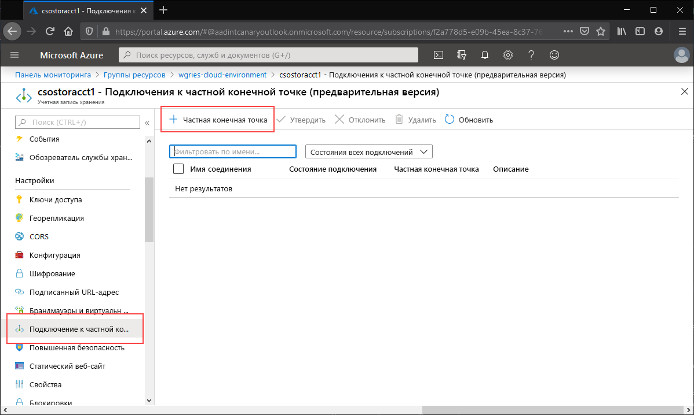
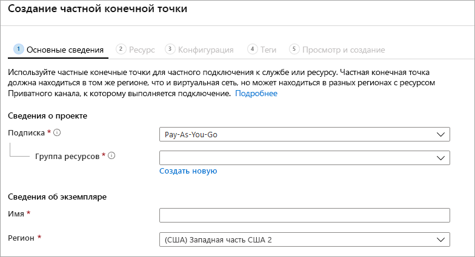
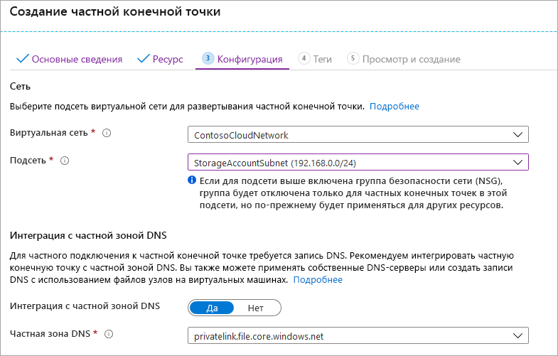

Перейдите к учетной записи хранения, для которой вы хотите создать частную конечную точку. В таблице содержимого для учетной записи хранения щелкните **Подключения к частной конечной точке**, а затем выберите **+ Частная конечная точка**, чтобы создать частную конечную точку. 

В мастере нужно будет заполнить несколько страниц.

В колонке **Основные сведения** выберите нужную группу ресурсов, имя и регион для частной конечной точки. Они могут быть любыми, но не должны совпадать с учетной записью хранения. Тем не менее необходимо создать частную конечную точку в том же регионе, что и виртуальная сеть, в которой вы хотите создать частную конечную точку.

В колонке **Ресурс** установите переключатель рядом с пунктом **Подключиться к ресурсу Azure в моем каталоге**. В разделе **Тип ресурса** выберите **Microsoft.Storage/storageAccounts** в качестве типа. Поле **Ресурсы** — это учетная запись хранения с общей папкой Azure, к которой требуется подключиться. Целевой подресурс — это **файл**, так как это требуется для Файлов Azure.

В колонке **Конфигурация** можно выбрать определенную виртуальную сеть и подсеть, в которую вы хотите добавить частную конечную точку. В подсети, в которую вы добавили конечную точку службы, необходимо выбрать отдельную подсеть. В колонке "Конфигурация" также содержатся сведения для создания или обновления частной зоны DNS. Мы рекомендуем использовать стандартную зону `privatelink.file.core.windows.net`.

Щелкните **Просмотр и создание**, чтобы создать частную конечную точку. 