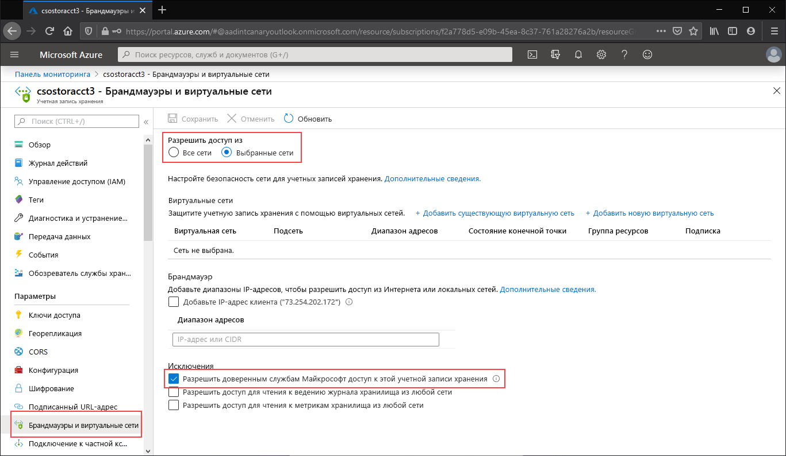

Перейдите к учетной записи хранения, для которой вы хотите запретить доступ к общедоступной конечной точке. В таблице содержимого для учетной записи хранения выберите **Брандмауэры и виртуальные сети**.

В верхней части страницы установите переключатель рядом с пунктом **Выбранные сети**. Это действие отобразит ряд скрытых параметров для управления ограничениями общедоступной конечной точки. Установите флажок **Разрешить доверенным службам Майкрософт доступ к этой учетной записи службы**, чтобы доверенные службы Майкрософт (например, Синхронизация файлов Azure) могли обращаться к этой учетной записи хранения.

