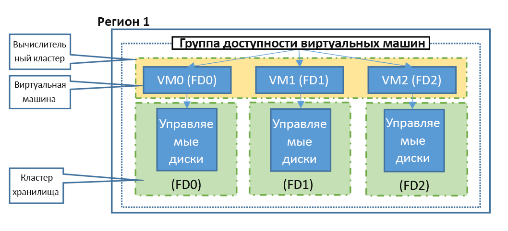

# Варианты доступности для виртуальных машин в Azure
В этой статье представлены общие сведения о возможностях доступности виртуальных машин Azure (ВМ).

## Группы доступности
Группа доступности — это логическое объединение виртуальных машин в центре обработки данных, которое позволяет Azure определить структуру вашего приложения, чтобы обеспечить избыточность и доступность. Для обеспечения высокой доступности приложения и достижения показателя [99,95 % уровня обслуживания (SLA) Azure](https://azure.microsoft.com/support/legal/sla/virtual-machines/) мы рекомендуем создать в группе доступности не менее двух виртуальных машин. Группа доступности представляется бесплатно, оплачивается только каждый созданный экземпляр виртуальной машины. Если отдельная виртуальная машина использует [SSD Azure (цен. категория "Премиум")](../articles/virtual-machines/windows/disks-types.md#premium-ssd), соглашение об уровне обслуживания Azure применяется для внеплановых мероприятий обслуживания.

Группа доступности включает в себя две дополнительные группы, обеспечивающие защиту от сбоев оборудования и позволяющие безопасно применять обновления, — это домены сбоя и домены обновления. Вы можете ознакомиться с дополнительными сведениями об управлении доступностью [виртуальных машин Linux](../articles/virtual-machines/linux/manage-availability.md) и [виртуальных машин Windows](../articles/virtual-machines/windows/manage-availability.md).

### Домены сбоя
Домен сбоя — это логическая группа базового оборудования, которое совместно использует общий источник питания и сетевой коммутатор, аналогично стойке в локальном центре обработки данных. При создании виртуальных машин в группе доступности платформа Azure автоматически распределяет их между такими доменами сбоя. Данный подход ограничивает влияние потенциальных сбоев физического оборудования, сети или электропитания.

### Домены обновления
Домен обновления — это логическая группа базового оборудования, которое может одновременно обслуживаться или перезагружаться. При создании виртуальных машин в группе доступности платформа Azure автоматически распределяет их между такими доменами обновления. Такой подход гарантирует, что по крайней мере один экземпляр приложения будет работать во время периодического обслуживания платформы Azure. Порядок перезагрузки доменов обновления при выполнении запланированного обслуживания может не быть последовательным, но за один раз будет перезагружаться только один домен обновления.

### Домены сбоя управляемых дисков
При использовании управляемой группы доступности виртуальные машины, использующие [управляемые диски Azure](../articles/virtual-machines/windows/faq-for-disks.md), согласовываются с доменами сбоя управляемого диска. Это гарантирует, что все управляемые диски, подключенные к виртуальной машине, относятся к одному домену сбоя управляемого диска. В управляемой группе доступности можно создать только виртуальные машины с управляемыми дисками. Количество доменов сбоя управляемых дисков зависит от региона: два или три на один регион. См. дополнительные сведения о доменах сбоя управляемых дисков для [виртуальных машин Linux](../articles/virtual-machines/linux/manage-availability.md?#use-managed-disks-for-vms-in-an-availability-set) и [виртуальных машин Windows](../articles/virtual-machines/windows/manage-availability.md?#use-managed-disks-for-vms-in-an-availability-set).

## Зоны доступности

[Зоны доступности](../articles/availability-zones/az-overview.md) — это альтернатива группам доступности. Это решение позволяет повысить уровень контроля, обеспечивая доступность приложений и данных на виртуальных машинах. Зона доступности — это физически изолированная зона в регионе Azure. В каждом поддерживаемом регионе Azure есть три зоны доступности. У каждой зоны доступности есть отдельный источник питания, сеть и система охлаждения. Вы можете защитить приложения и данные от потери в центре обработки данных, настроив свои решения для использования реплицированных виртуальных машин в зонах доступности. В случае неполадок с одной зоной реплицированные приложения и данные сразу же станут доступными в другой зоне. 

См. дополнительные сведения о развертывании виртуальных машин [Windows](../articles/virtual-machines/windows/create-powershell-availability-zone.md) или [Linux](../articles/virtual-machines/linux/create-cli-availability-zone.md) в зонах доступности.

## Следующие шаги
Теперь вы можете использовать функции доступности и избыточности для создания среды Azure. Рекомендации см. в статье [Контрольный список для обеспечения доступности](../articles/best-practices-availability-checklist.md).

