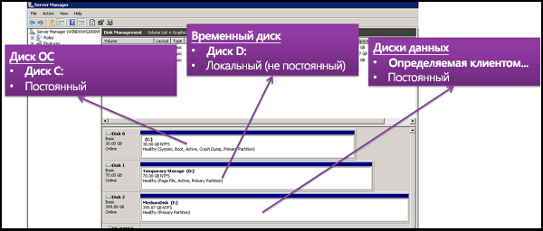
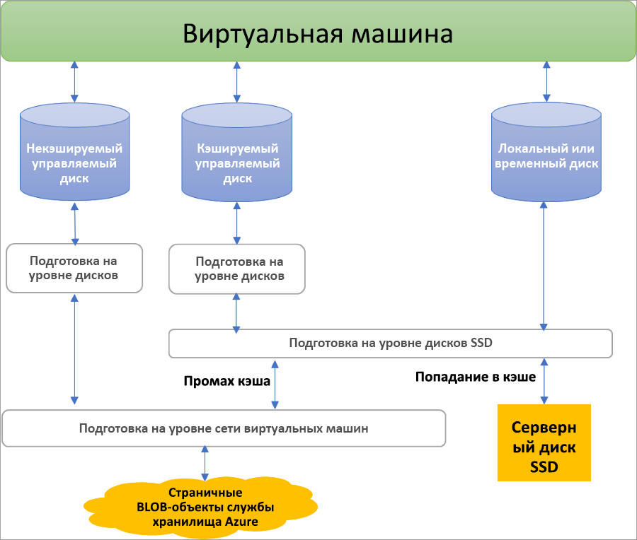
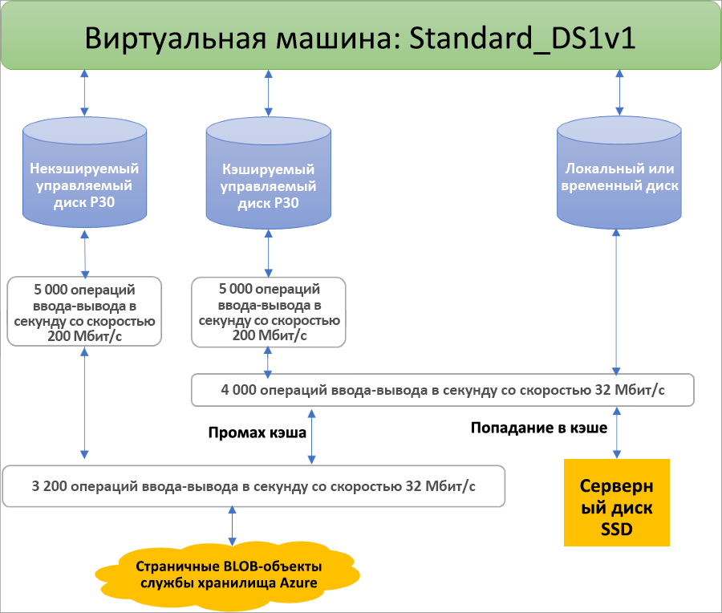

## Преимущества управляемых дисков

Рассмотрим некоторые преимущества использования управляемых дисков.

### Высокая устойчивость и доступность

Управляемые диски обеспечивают доступность на уровне 99,999 %. Для этого предоставляются три реплики данных, обеспечивающие высокую надежность. При сбое одной реплики можно задействовать остальные, что гарантирует длительное хранение данных и высокую устойчивость к сбоям. Эта архитектура позволила Azure гарантировать надежность дисков IaaS корпоративного уровня с ведущим в отрасли нулевым показателем процента брака по итогам продаж в течение одного года.

### Простое и масштабируемое развертывание виртуальной машины

При использовании управляемых дисков можно создать до 50 000 **дисков** виртуальных машин определенного типа в подписке на регион, что дает возможность создавать тысячи **виртуальных машин** в пределах одной подписки. Этот компонент также повышает масштабируемость [масштабируемых наборов виртуальных машин](../articles/virtual-machine-scale-sets/virtual-machine-scale-sets-overview.md), позволяя создавать до тысячи виртуальных машин в масштабируемом наборе с помощью образа Marketplace.

### Интеграция с группами доступности

Управляемые диски интегрируются с группами доступности. Это гарантирует, что диски [виртуальных машин в группе доступности](../articles/virtual-machines/windows/manage-availability.md#use-managed-disks-for-vms-in-an-availability-set) достаточно изолированы друг от друга, что позволяет избежать единых точек сбоя. Диски автоматически размещаются в разных единицах масштабирования хранилища (метках). В случае сбоя стека из-за проблем с оборудованием или программным обеспечением выйдет из строя только тот экземпляр виртуальной машины, диски которой расположены в этом стеке. Предположим, есть приложение, запущенное на пяти виртуальных машинах, расположенных в одной группе доступности. Диски этих виртуальных машин не хранятся в одном стеке, поэтому если один стек выйдет из строя, другие экземпляры приложения продолжат работу.

### Интеграция с Зонами доступности

Управляемые диски с поддержкой [зон доступности](../articles/availability-zones/az-overview.md) — предложение, обеспечивающее высокий уровень доступности и защищающее приложения от сбоев центров обработки данных. Зоны доступности — уникальные физические расположения в пределах одного региона Azure. Каждая зона состоит из одного или нескольких центров обработки данных, оснащенных независимыми системами электроснабжения, охлаждения и сетевого взаимодействия. Чтобы обеспечить отказоустойчивость, во всех включенных регионах используются минимум три отдельные зоны. Благодаря зонам доступности Azure предлагает наилучшее в отрасли соглашение об уровне обслуживания с гарантией времени непрерывной работы 99,99 % для виртуальных машин.

### Поддержка резервного копирования Azure

Чтобы обеспечить защиту от региональных сбоев, можно использовать [Azure Backup](../articles/backup/backup-overview.md), чтобы создать задание резервного копирования, выполняющее резервное копирование по расписанию и с учетом политик хранения резервных копий. Это позволит легко восстанавливать виртуальные машины при необходимости. Служба Azure Backup сейчас поддерживает резервное копирование и восстановление управляемых дисков. [Подробнее](../articles/backup/backup-support-matrix-iaas.md) о поддержке резервного копирования виртуальной машины Azure.

### Детальный контроль доступа

Вы можете использовать [управление доступом на основе ролей в Azure](../articles/role-based-access-control/overview.md), чтобы назначить определенные разрешения для управляемых дисков одному или нескольким пользователям. Управляемые диски позволяют выполнять различные операции, в том числе чтение, запись (создание или обновление), удаление и извлечение [универсального кода ресурса (URI) подписанного URL-адреса (SAS) ](../articles/storage/common/storage-dotnet-shared-access-signature-part-1.md) для диска. Вы можете предоставить пользователям доступ только к тем операциям, которые необходимы им для выполнения определенного задания. Если вы не хотите, чтобы пользователь имел возможность копировать управляемые диски в учетную запись хранения, можно не предоставлять ему доступ к действию экспорта для этого управляемого диска. Если вы не хотите, чтобы пользователь использовал URI SAS для копирования управляемого диска, можно не предоставлять ему такое разрешение для этого диска.

### Отправка виртуального жесткого диска

 Прямая отправка упрощает передачу виртуального жесткого диска на управляемый диск Azure. Ранее необходимо было выполнить более сложный процесс, который включал в себя промежуточное хранение данных в учетной записи хранения. Теперь шагов меньше. Стало проще отправлять локальные виртуальные машины в Azure, отправлять их на большие управляемые диски, а также упрощен процесс резервного копирования и восстановления. Это также сокращает затраты, позволяя отправлять данные на управляемые диски напрямую, не присоединяя их к виртуальным машинам. Вы можете использовать прямую отправку для отправки виртуальных жестких дисков размером до 32 Тиб.

 Сведения о том, как передавать виртуальный жесткий диск в Azure, см. в статьях [об отправке с помощью CLI](../articles/virtual-machines/linux/disks-upload-vhd-to-managed-disk-cli.md) или [PowerShell](../articles/virtual-machines/windows/disks-upload-vhd-to-managed-disk-powershell.md).

## Шифрование

Управляемые диски поддерживают два разных типа шифрования. Первый из них — это шифрование на стороне сервера (SSE), которое выполняет служба хранилища, второй — шифрование дисков Azure, которые можно включить на дисках операционной системы и данных для виртуальных машин.

### Шифрование на стороне сервера

[Шифрование на стороне сервера Azure](../articles/virtual-machines/windows/disk-encryption.md) предоставляет возможность шифрования неактивных данных и защищает данные в соответствии с предложениями по безопасности и соответствию вашей организации. Шифрование на стороне сервера включено по умолчанию для всех управляемых дисков, моментальных снимков и образов во всех регионах, где доступны управляемые диски. Вы можете разрешить службе Azure управлять ключами (ключи под управлением платформы) или делать это самостоятельно (ключи под управлением клиента, которые доступны в предварительной версии). Дополнительные сведения см. в статье [Часто задаваемые вопросы о дисках виртуальных машин Azure IaaS, а также об управляемых и неуправляемых дисках класса "Премиум"](../articles/virtual-machines/windows/faq-for-disks.md#managed-disks-and-storage-service-encryption).

### Шифрование дисков Azure

Шифрование дисков Azure позволяет шифровать диски ОС и диски данных, используемые виртуальными машинами IaaS. Шифрование включает в себя управляемые диски. Для Windows диски шифруются с помощью стандартной отраслевой технологии шифрования BitLocker. Для Linux диски шифруются с помощью технологии DM-Crypt. Процесс шифрования интегрируется с Azure Key Vault, что позволяет управлять ключами шифрования дисков. Дополнительные сведения см. в статье [Шифрование дисков Azure для виртуальных машин IaaS](../articles/security/azure-security-disk-encryption-overview.md).

## Роли дисков

В Azure есть три основные роли дисков: диск данных, диск операционной системы и временный диск. Эти роли назначаются дискам, подключенным к виртуальной машине.

### Диск данных

Диск данных — управляемый диск, подключенный к виртуальной машине для хранения данных приложений или других необходимых данных. Диски данных регистрируются как диски SCSI и обозначаются любой указанной буквой. Максимальная емкость каждого диска составляет 32 767 ГиБ. Размер виртуальной машины определяет, сколько дисков данных можно подключить и какой тип хранилища можно использовать для размещения дисков.

### Диск ОС

У каждой виртуальной машины есть один подключенный диск операционной системы. На этот диск предварительно установлена операционная система которая была выбран при создании виртуальной машины. Этот диск содержит загрузочный том.

Максимальная емкость этого диска составляет 2048 ГиБ.

### Временный диск

Каждая виртуальная машина содержит временный диск, который не является управляемым диском. Он выступает в качестве временного хранилища для приложений и процессов и предназначен только для хранения данных, таких как страничные файлы или файлы подкачки. Данные на временном диске могут быть потеряны во время [обслуживания](../articles/virtual-machines/windows/manage-availability.md?toc=%2fazure%2fvirtual-machines%2fwindows%2ftoc.json#understand-vm-reboots---maintenance-vs-downtime) или при [повторном развертывании виртуальной машины](../articles/virtual-machines/troubleshooting/redeploy-to-new-node-windows.md?toc=%2Fazure%2Fvirtual-machines%2Fwindows%2Ftoc.json). В виртуальных машинах Azure Linux временный диск отмечен по умолчанию как /dev/sdb, а на виртуальных машинах Windows — как D:. Во время стандартной корректной перезагрузки виртуальной машины данные на временном диске сохраняются.

## Моментальные снимки управляемых дисков

Моментальный снимок управляемого диска — это полная отказоустойчивая копия управляемого диска, доступная только для чтения, которая по умолчанию хранится в качестве управляемого диска ценовой категории "Стандартный". С помощью моментальных снимков можно архивировать управляемые диски на любой момент времени. Эти моментальные снимки могут существовать независимо от исходного диска и использоваться для создания других управляемых дисков. 

Плата за моментальные снимки взимается в зависимости от используемого размера. Например, если создается моментальный снимок управляемого диска с подготовленной емкостью 64 Гиб и фактическим объемом используемых данных 10 Гиб, оплачиваются только используемые данные, то есть 10 Гиб. Просмотреть использованный размер моментальных снимков можно в [отчете об использовании Azure](https://docs.microsoft.com/azure/billing/billing-understand-your-bill). Например, если размер данных моментального снимка составляет 10 ГиБ, использованное количество в **ежедневном** отчете об использовании будет отражено так: 10 ГиБ/(31 день) = 0,3226.

Дополнительные сведения о создании моментальных снимков для управляемых дисков см. в следующих статьях.

* [Создание моментального снимка управляемого диска в Windows](../articles/virtual-machines/windows/snapshot-copy-managed-disk.md)
* [Создание моментального снимка управляемого диска в Linux](../articles/virtual-machines/linux/snapshot-copy-managed-disk.md)

### Образы

Управляемые диски также поддерживают создание управляемых пользовательских образов. Вы можете создать образ из пользовательского VHD-файла в учетной записи хранения или непосредственно из универсальной (подготовленной с помощью программы sysprep) виртуальной машины. При этом создается один образ. Он содержит все управляемые диски, связанные с виртуальной машиной, включая диски операционной системы и диски данных. Таким образом, вы можете создавать сотни виртуальных машин с помощью пользовательского образа без необходимости копировать все учетные записи хранения или управлять ими.

Дополнительные сведения о создании образов см. в следующих статьях:

* [How to capture a managed image of a generalized VM in Azure](../articles/virtual-machines/windows/capture-image-resource.md) (Как создать управляемый образ обобщенной виртуальной машины в Azure)
* [Как генерализовать и создать образ виртуальной машины Linux при помощи Azure CLI](../articles/virtual-machines/linux/capture-image.md)

#### Образы и моментальные снимки

Важно понять разницу между образами и моментальными дисками. При использовании управляемых дисков можно создать образ универсальной виртуальной машины, распределение которой было отменено. Этот образ будет содержать все диски, подключенные к этой виртуальной машине. Его можно использовать для создания новой виртуальной машины, которая также будет содержать все эти диски.

Моментальный снимок — это копия диска на момент создания снимка. Она относится только к одному диску. Если у виртуальной машины только один диск (диск операционной системы), можно создать моментальный снимок или образ, а затем на основе одного из них создать виртуальную машину.

Моментальный снимок содержит сведения только о хранящемся в нем диске. Поэтому моментальные снимки сложно использовать в сценариях, требующих управления несколькими дисками, таких как чередование. Моментальные снимки пришлось бы согласовывать между собой, и эта возможность пока не поддерживается.

## Распределение диска и его производительность

На следующей схеме показано распределение пропускной способности и операций ввода-вывода для дисков в режиме реального времени с помощью трехуровневой системы подготовки:

На первом уровне подготовки задаются операции ввода-вывода на диск и пропускная способность.  На втором уровне узел сервера вычислений реализует подготовку SSD, применяя его только к данным, хранящимся на SSD сервера, в том числе к дискам с кэшированием (ReadWrite и ReadOnly), а также к локальным и временным дискам. Наконец, подготовка сети виртуальной машины выполняется на третьем уровне для любых операций ввода-вывода, которые узел вычислений отправляет в серверную часть службы хранилища Azure. При такой схеме производительность виртуальной машины зависит от различных факторов, от того, как виртуальная машина использует локальный SSD, к количеству подключенных дисков, а также к типу производительности и кэширования подключенных дисков.

В качестве примера этих ограничений виртуальная машина Standard_DS1v1 не достигают 5000 операций ввода-вывода в секунду для диска P30, независимо от того, кэширован он или нет, из-за ограничений на уровнях SSD и сети:

Azure использует приоритетный сетевой канал для дискового трафика, который получает приоритет над другим низкоприоритетным сетевым трафиком. Это помогает дискам поддерживать ожидаемую производительность в случае сетевых состязаний. Аналогичным образом служба хранилища Azure обрабатывает состязание за ресурсы и другие проблемы в фоновом режиме с автоматической балансировкой нагрузки. Служба хранилища Azure выделяет необходимые ресурсы при создании диска и применяет упреждающее и реактивное распределение ресурсов для управления уровнем трафика. Благодаря этому диски могут поддерживать ожидаемые целевые значения операций ввода-вывода и пропускной способности. При необходимости метрики уровня виртуальной машины и уровня диска можно использовать для наблюдения за производительностью и настройками.

Чтобы получить рекомендации по оптимизации конфигурации виртуальной машины и диска для достижения желаемой производительности, см. статью [О проектировании для повышения производительности](../articles/virtual-machines/windows/premium-storage-performance.md).

## Дополнительная информация

Узнайте больше о типах дисков, предлагаемых в Azure, и выберите тип, который подходит для ваших нужд, и ознакомьтесь с их показателями производительности, почитав нашу статью о типах дисков.
