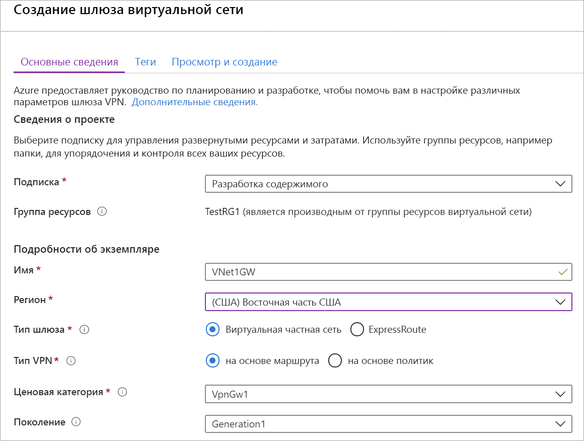
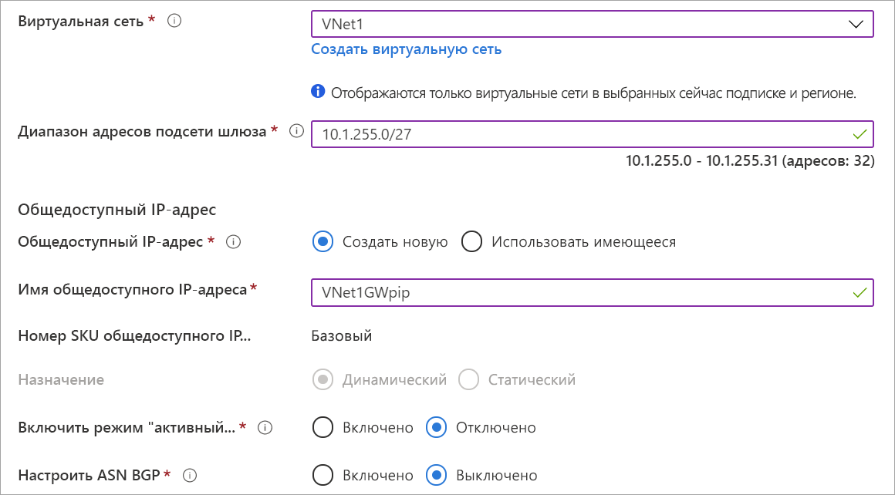

1. В меню [портал Azure](https://portal.azure.com) выберите **создать ресурс**. 

   
2. В поле **Поиск в Marketplace** введите "шлюз виртуальной сети". Найдите **шлюз виртуальной сети** в результатах поиска и выберите запись. На странице **шлюз виртуальной сети** выберите **создать**. Откроется страница **Создание шлюза виртуальной сети**.
3. На вкладке **Основные сведения** введите значения для шлюза виртуальной сети.

   

   

   **Сведения о проекте**

   - **Подписка**. Выберите подписку, которую вы хотите использовать из раскрывающегося списка.
   - **Группа ресурсов**. Этот параметр автоматически заполняется при выборе виртуальной сети на этой странице.

   **Сведения об экземпляре**

   - **Имя**. Назовите свой шлюз. Имя шлюза не совпадает с именем подсети шлюза. Это имя объекта шлюза, который создается.
   - **Регион**: Выберите регион, в котором вы хотите создать этот ресурс. Регион для шлюза должен быть таким же, как и виртуальная сеть.
   - **Тип шлюза**. Выберите **VPN**. VPN-шлюзы используют тип шлюза виртуальной сети **VPN**.
   - **Тип VPN**. Выберите тип VPN, который указан для конфигурации. Для большинства конфигураций требуется тип VPN на основе маршрута.
   - **SKU**. Выберите номер SKU шлюза из раскрывающегося списка. Номера SKU, перечисленные в раскрывающемся списке, зависят от выбранного типа VPN. Дополнительные сведения о номерах SKU шлюзов см. в разделе [SKU шлюзов](../articles/vpn-gateway/vpn-gateway-about-vpn-gateway-settings.md#gwsku).
   - **Создание**. сведения о создании VPN-шлюза см. в статье [SKU шлюзов](../articles/vpn-gateway/vpn-gateway-about-vpngateways.md#gwsku).
   - **Виртуальная сеть**: в раскрывающемся списке выберите виртуальную сеть, в которую необходимо добавить этот шлюз.
   - **Диапазон адресов подсети шлюза**. это поле отображается только в том случае, если в виртуальной сети нет подсети шлюза. Если возможно, сделайте диапазон/27 или больше (/26,/25 и т. д.). Не рекомендуется создавать диапазоны меньше/28. Если у вас уже есть подсеть шлюза, вы можете просмотреть сведения о GatewaySubnet, перейдя к своей виртуальной сети. Щелкните **подсети** , чтобы просмотреть диапазон. Если вы хотите изменить диапазон, можно удалить и повторно создать GatewaySubnet.

   **Общедоступный IP-адрес**. Этот параметр задает объект общедоступного IP-адреса, который связывается с VPN-шлюзом. Общедоступный IP-адрес динамически назначается этому объекту при создании VPN-шлюза. Общедоступный IP-адрес изменяется только после удаления и повторного создания шлюза. При изменении размера, сбросе или других внутренних операциях обслуживания или обновления IP-адрес VPN-шлюза не изменяется.

     - **Общедоступный IP-адрес**: оставьте поле **создать** выбранным.
     - **Имя общедоступного IP-адреса**: в текстовом поле введите имя для экземпляра общедоступного IP-адреса.
     - **Назначение**: VPN-шлюз поддерживает только динамические.

   **Режим "активный — активный**". Если вы создаете конфигурацию шлюза "активный — активный", выберите только **режим "включить активный — активный** ". В противном случае не выбирайте этот параметр.

   Не выбирайте параметр **Настроить ASN BGP**, кроме случаев, когда его выбор обусловлен используемой конфигурацией. Если этот параметр необходим, по умолчанию для ASN устанавливается значение 65515, которое при необходимости можно изменить.
4. Выберите **проверить и создать** , чтобы запустить проверку. После завершения проверки выберите **создать** , чтобы развернуть VPN-шлюз. Для полного создания и развертывания шлюза может потребоваться до 45 минут. Состояние развертывания можно просмотреть на странице Обзор шлюза.

После создания шлюза вы можете просмотреть назначенный ему IP-адрес в разделе сведений о виртуальной сети на портале. Шлюз будет отображаться как подключенное устройство.
