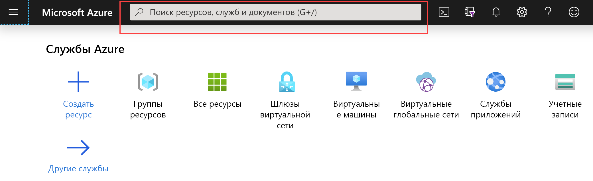
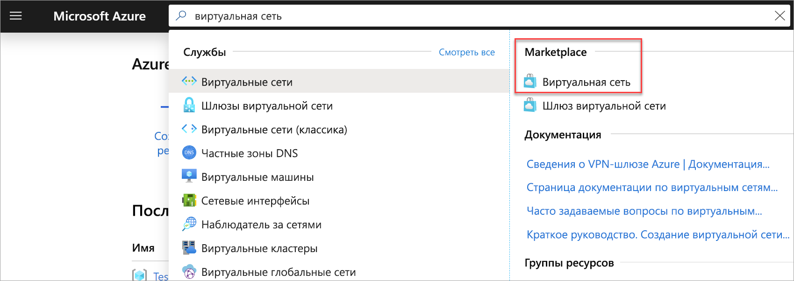
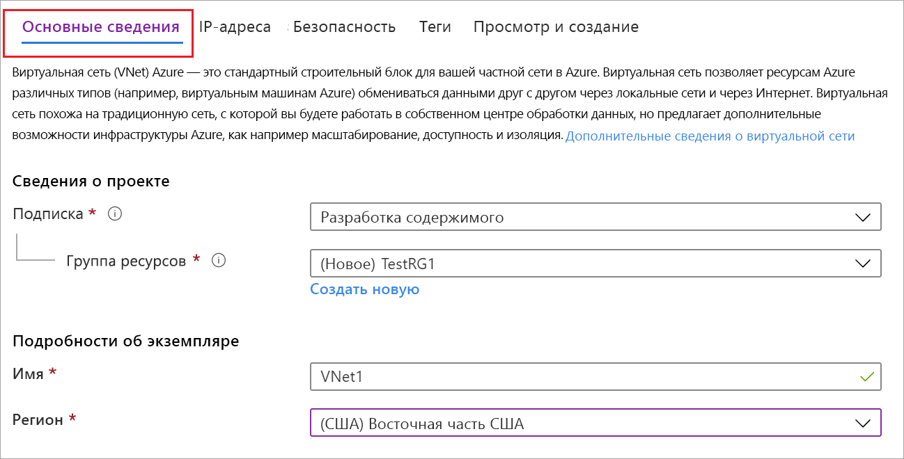
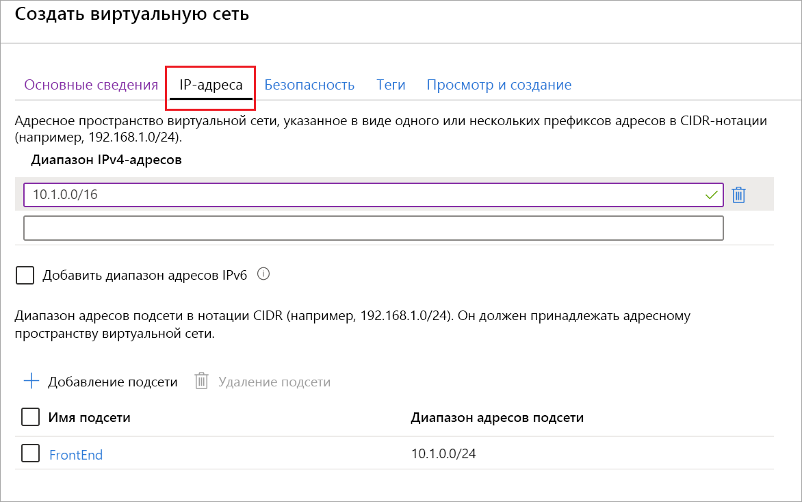

1. Войдите на [портал Azure](https://portal.azure.com).
1. В поле **Поиск ресурсов, служб и документов (G+/)** введите *виртуальная сеть*.

   
1. Выберите **Виртуальная сеть** в результатах **Marketplace**.

   
1. На странице **Виртуальная сеть** выберите **Создать**.

   
1. После выбора пункта **Создать** откроется страница **Создание виртуальной сети**.
1. На вкладке **Основные сведения** введите **сведения о проекте** и **сведения об экземпляре** в параметрах виртуальной сети.

    Если введенные в поля значения допустимы, рядом с полем появится значок зеленой галочки. Некоторые значения автоматически заполнены. Вы можете заменить их собственными значениями:

   - **Подписка**. Убедитесь, что указана правильная подписка. Подписки можно менять с помощью раскрывающегося списка.
   - **Группа ресурсов.** Выберите существующую группу ресурсов или щелкните **Создать**, чтобы создать новую. Дополнительные сведения о группах ресурсов см. в статье [Общие сведения об Azure Resource Manager](../articles/azure-resource-manager/management/overview.md#resource-groups).
   - **Name** (Имя). Введите имя виртуальной сети.
   - **Регион**. Выберите расположение для виртуальной сети. Расположение определяет, где будут находиться ресурсы, развертываемые в этой виртуальной сети.

1. На вкладке **IP-адреса** настройте значения. Значения ниже приведены только для примера. Измените их в соответствии с нужными вам параметрами.

     
   - **Диапазон IPv4-адресов.** По умолчанию адресное пространство создается автоматически. Вы можете щелкнуть адресное пространство, чтобы изменить значения на нужные вам. Вы также можете добавить дополнительные адресные пространства.
   - **Подсеть.** Если используется адресное пространство по умолчанию, подсеть по умолчанию создается автоматически. При изменении адресного пространства необходимо добавить подсеть. Выберите **+ Добавить подсеть**, чтобы открыть окно **Добавление подсети**. Настройте следующие параметры и выберите **Добавить**, чтобы добавить значения:
      - **Имя подсети**. В этом примере используется подсеть с именем FrontEnd.
      - **Диапазон адресов подсети.** Диапазон адресов для этой подсети.

1. На вкладке **Безопасность** пока оставьте значения по умолчанию:

   - **Защита от атак DDos.** Basic
   - **Брандмауэр.** Выключено
1. Выберите **Проверка и создание**, чтобы проверить настройки виртуальной сети.
1. После проверки настроек выберите **Создать**.
