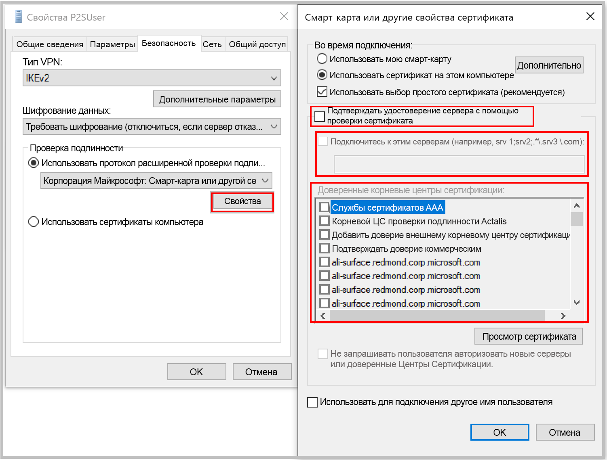

[!INCLUDE [P2S FAQ All](vpn-gateway-faq-p2s-all-include.md)]

### Что делать, если при подключении с помощью проверки подлинности сертификата я получаю несоответствие сертификата?

Отоверьте **"Проверить личность сервера, проверяя сертификат"** или **добавить сервер F-DN вместе с сертификатом** при создании профиля вручную. Вы можете сделать это, запустив **rasphone** из запроса команды и выбрав профиль из списка выпадающих.

Обход проверки личности сервера в целом не рекомендуется, но при аутентификации сертификата Azure тот же сертификат используется для проверки сервера в протоколе vpn tunneling (IKEv2/SSTP) и протоколе EAP. Так как сертификат сервера и F-DN уже проверены протоколом туннелирования VPN, проверить то же самое в EAP является излишним.

### Могу ли я использовать свой внутренний PKI root CA для создания сертификатов для подключения к сайту?

Да. Раньше поддерживались только самозаверяющие корневые сертификаты. Вы по-прежнему можете загружать до 20 корневых сертификатов.

### Могу ли я использовать сертификаты из Azure Key Vault?

Нет.

### Какие инструменты можно использовать для создания сертификатов?

Можно использовать решение Enterprise PKI (внутренняя инфраструктура открытых ключей), Azure PowerShell, MakeCert и OpenSSL.

### Есть инструкции по выбору параметров сертификата?

* **Внутренняя инфраструктура открытых ключей и решение Enterprise PKI:** см. инструкции по [созданию сертификатов](../articles/vpn-gateway/vpn-gateway-howto-point-to-site-resource-manager-portal.md#generatecert).

* **Azure PowerShell:** см. инструкции по работе с [Azure PowerShell](../articles/vpn-gateway/vpn-gateway-certificates-point-to-site.md).

* **MakeCert:** см. инструкции по работе с [MakeCert](../articles/vpn-gateway/vpn-gateway-certificates-point-to-site-makecert.md).

* **Openssl:** 

    * При экспорте сертификатов преобразуйте корневой сертификат в кодировку Base64.

    * Для сертификата клиента:

      * При создании закрытого ключа укажите длину 4096.
      * При создании сертификата для параметра *-extensions* укажите значение *usr_cert*.
